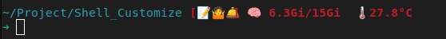

[< back](../README.md)

--- 

# Starship example



```bash
"$schema" = 'https://starship.rs/config-schema.json'

add_newline = true


format = '$all'

## Format-Beispiel like '$all'

# format = """
# $username\
# $hostname\
# $localip\
# $shlvl\
# $singularity\
# $kubernetes\
# $directory\
# $vcsh\
# $fossil_branch\
# $fossil_metrics\
# $git_branch\
# $git_commit\
# $git_state\
# $git_metrics\
# $git_status\
# $hg_branch\
# $pijul_channel\
# $docker_context\
# $package\
# $c\
# $cmake\
# $cobol\
# $daml\
# $dart\
# $deno\
# $dotnet\
# $elixir\
# $elm\
# $erlang\
# $fennel\
# $gleam\
# $golang\
# $guix_shell\
# $haskell\
# $haxe\
# $helm\
# $java\
# $julia\
# $kotlin\
# $gradle\
# $lua\
# $nim\
# $nodejs\
# $ocaml\
# $opa\
# $perl\
# $php\
# $pulumi\
# $purescript\
# $python\
# $quarto\
# $raku\
# $rlang\
# $red\
# $ruby\
# $rust\
# $scala\
# $solidity\
# $swift\
# $terraform\
# $typst\
# $vlang\
# $vagrant\
# $zig\
# $buf\
# $nix_shell\
# $conda\
# $meson\
# $spack\
# $memory_usage\
# $aws\
# $gcloud\
# $openstack\
# $azure\
# $nats\
# $direnv\
# $env_var\
# $crystal\
# $custom\
# $sudo\
# $cmd_duration\
# $line_break\
# $jobs\
# $battery\
# $time\
# $status\
# $os\
# $container\
# $shell\
# $character\
# """


[username]
style = "blue"
show_always = true

## for ascii picture
#[custom.ascii_art]
#command = "cat ~/ascii_art.txt"
#when = "true"
#style = "bold purple"

[character]
success_symbol = '[➜](bold green)'
error_symbol = '[🤬Error🤬](bold red) '

[custom.sysinfo]
command = '''
TEMP=$(cat /sys/class/thermal/thermal_zone0/temp | awk '{printf("%.1f°C", $1/1000)}')
MEM=$(free -h | awk '/Mem:/ {print $3 "/" $2}')
echo "🧠 $MEM  🌡️ $TEMP"
'''
when = "true"
style = "bold red"

[package]
disabled = true

[cmd_duration]
min_time = 5000
format = 'underwent [$duration](bold yellow)'

[aws]
disabled = true

[azure]
format = 'on [$symbol($subscription)]($style) '
disabled = true

[gcloud]
disabled = true

[directory]
style = "cyan"
truncation_length = 5  
truncate_to_repo = false  

[docker_context]
disabled = true

[git_branch]
ignore_branches = ['master', 'main']

[git_status]
conflicted = '🏳'
ahead = '🏎💨'
behind = '😰'
diverged = '😵'
up_to_date = '🛎️'
untracked = '🤷'
stashed = ''
modified = '📝'
staged = '[++\($count\)](green)'
renamed = '👅'
deleted = '🗑'
disabled = false

[sudo]
disabled = false
```